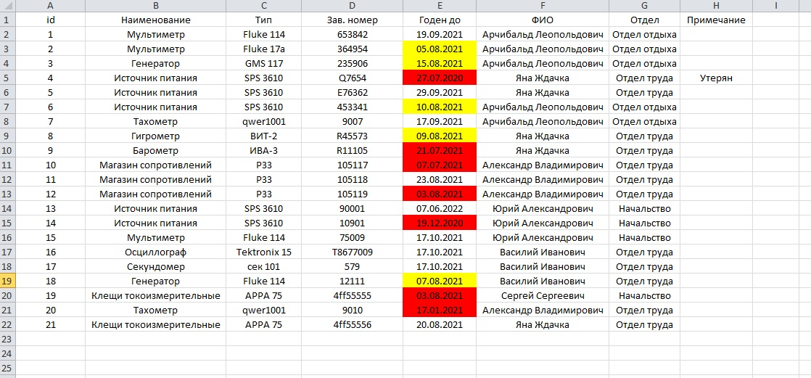
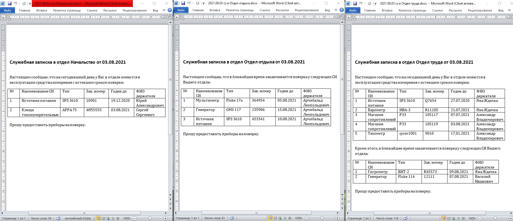
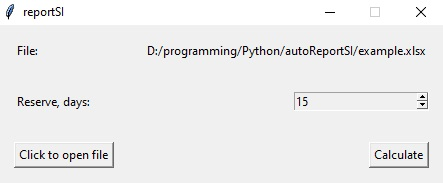
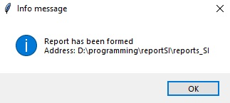

This program is intended for looking for expired appliances or appliances which will expired soon in excel table database (each appliance must be verified yearly, if not - it is considered as expired and can’t be used anymore). The program represents results of searching in form of .docx files. Each .docx file contains appliances of corresponding department.  
In order the program work correctly, there are several rules to excel table of appliances.
1) The first row of excel file must be a header of the table (an example of appliances table is provided in figure 1);
2) In the header must be column “годен до”;
3) Format data in column “годен до” must be “datatime”.

### Figure 1 – Format of database

Red – expired appliances, yellow – appliances which will expire soon (in program you can specify this term in days), if today is 03.08.2021, and reserve term 15 days. 
### Figure 2 – Output .docx files

### Figure 3 – Program interface

### Figure 4 – Info message which will be shown if process go smoothly 

You can download example.xlsx and reportSI.rar and try.
